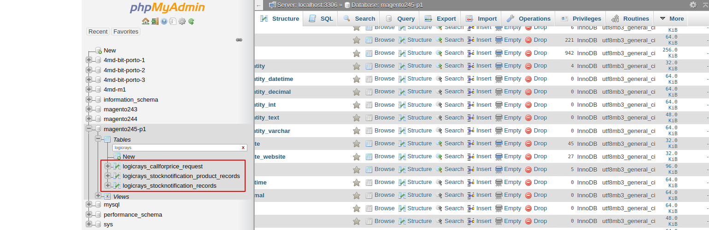

Uninstall Extension
===================

Uninstall (Copy-and-paste method)
`````````````````````````````````

Delete the following files and folders

    :guilabel:`app/code/Logicrays/Callforprice`

Run the following command line::

    php bin/magento setup:upgrade

First of all Delete database tables:

Now open a Mysql mangement such as :guilabel:`PHPMyAdmin`

Open your database and Find table with prefix: ``logicrays_Callforprice``

Delete all the database tables related to ``logicrays_Callforprice`` see below image.



If you have any questions, feel free to contact us at https://www.logicrays.com/contact-us