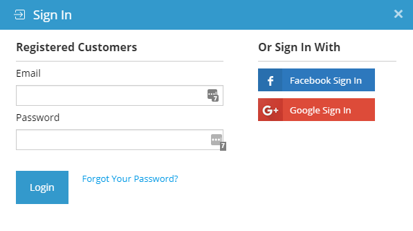
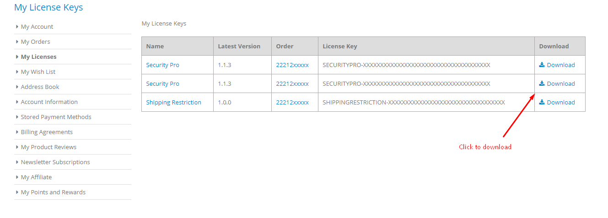
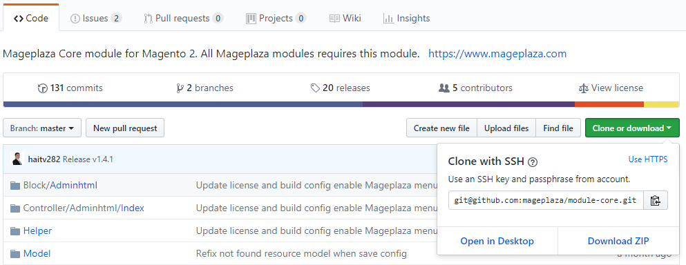

Magento Extensions Installation Document
========================================

In this topic, we will discuss about **How to Install Magento 2 extensions**, specially Install Logicrays Extensions. There are 3 different solutions to install `Magento 2 extensions <https://www.logicrays.com/>`_ from Logicrays:

* `Solution #1: Ready to paste <https://www.logicrays.com/>`_ (applicable to both paid and free extensions of Logicrays)
* `Solution #2. Install via Composer <https://www.logicrays.com/>`_ (only applicable to free extensions of Logicrays)
* `Solution #3. Install via Magento Marketplace <https://www.logicrays.com/>`_
* `FAQs <https://www.logicrays.com/>`_

Important:
^^^^^^^^^^
* You need to install Logicrays_Base module along with your purchased modules.

To Install Magento 2 Extension by Logicrays:
````````````````````````````````````````````
**Select a solution based on downloaded package:**

Solution #1: Ready to paste
```````````````````````````
Download SFTP clients, we recommend clients: `FileZilla <https://www.logicrays.com/>`_, `WinSCP <https://www.logicrays.com/>`_. In this case, we are using **WinSCP** to install `Magento 2 One Step Checkout <https://www.logicrays.com/>`_ and `Layered Navigation Ultimate <https://www.logicrays.com/>`_ .

Step 2: Download the Package
````````````````````````````
After purchasing order from Mageplaza, go to `My Downloadable Products <https://www.logicrays.com/>`_ page to download the One Step Checkout package. You have to log in (User/Password or Social accounts) before accessing the ``My Licenses``.



Here are the screenshot of ``My Licenses`` page.



Now click on extension version link to download the package.

.. image:: img/download.png
    :alt: sdgfgv

Step 3: Download the Mageplaza_Core module from Github
``````````````````````````````````````````````````````
You can either clone or download the module at this link: `https://github.com/mageplaza/module-core <https://github.com/mageplaza/module-core>`_



Run the following command in Magento 2 root folder to install Logicrays base. ::

    composer require mageplaza/module-core
    php bin/magento setup:upgrade
    php bin/magento setup:di:compile
    php bin/magento setup:static-content:deploy

Learn more how to install Logicrays_Base here

Step 4: Upload files to server
``````````````````````````````
Let’s extract the package and connect to your server using SFTP Clients above. Then upload files, folders to your server, see this video:

 .. image:: img/video.gif
    :alt: kjfdjkf

Upload the app folder to Magento 2 root folder.

Step 4: Run command line
````````````````````````
To complete the installation process, we need to run the following command lines: ::
    
    php bin/magento setup:upgrade
    php bin/magento setup:di:compile
    php bin/magento setup:static-content:deploy

If you got the error: ``Logicrays_Base has been already defined``, read this solution

Step 5: Check result
````````````````````
Now time to check result in frontend.

If you get any issues, check `FAQs <https://github.com/mageplazae/module-core>`_. If you still get stuck, get support at `Logicrays Helpdesk <https://github.com/mageplaza/module-core>`_

Solution #2: Composer
`````````````````````
In this guide, we will show you how to install `Logicrays Blog extension <https://github.com/mageplazae/module-core>`_ one of the best-seller extensions at Mageplaza.

**IMPORTANT NOTE: The solution presented below is only applied for free extensions. Now, you can install Logicrays paid extensions via composer too. To read the full instruction, plesae follow this guide:** `HOW TO INSTALL MAGENTO EXTENSIONS VIA COMPOSER <https://github.com/mageplazae/module-core>`_.

Run the following command in Magento 2 root folder:

**Blog** ::
    
    composer require mageplaza/magento-2-blog-extension
    php bin/magento setup:upgrade
    php bin/magento setup:di:compile
    php bin/magento setup:static-content:deploy