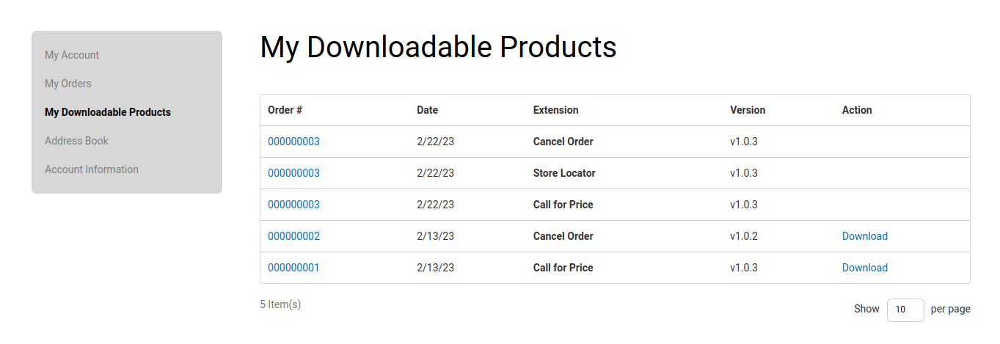

Magento Extensions Installation Document
========================================

In this topic, we will discuss about **How to Install Magento 2 extensions**, specially Install Logicrays Extensions. There are 3 different solutions to install `Magento 2 extensions <https://www.logicrays.com/>`_ from Logicrays:

* `#1: Ready to paste <https://www.logicrays.com/>`_ (applicable to both paid and free extensions of Logicrays)
* `#2. Install via Composer <https://www.logicrays.com/>`_ (only applicable to free extensions of Logicrays)
* `#3. Install via Magento Marketplace <https://www.logicrays.com/>`_
* `FAQs <https://www.logicrays.com/>`_

Important:
^^^^^^^^^^
* You need to install Logicrays_Base module along with your purchased modules.

To Install Magento 2 Extension by Logicrays:
````````````````````````````````````````````
**Select a solution based on downloaded package:**

#1: Ready to paste
```````````````````````````
Download SFTP clients, we recommend clients: `FileZilla <https://www.logicrays.com/>`_, `WinSCP <https://www.logicrays.com/>`_. In this case, we are using **FileZilla** to install Magento 2 `Callforprice <https://www.logicrays.com/>`_.

Step 2: Download the Package
````````````````````````````
After purchasing order from Logicrays, go to `My Downloadable Products <http://store.logicrays.com/downloadable/customer/products/>`_ page to download the Callforprice. You have to log in (User/Password or Social accounts) before accessing the ``My Downloadable Products``.

.. image:: img/Customer-Login.png
    :alt: Login

Here are the screenshot of ``My Downloadable Products`` page.



Now click on extension version link to download the package.


Step 3: Extract the package
``````````````````````````````````````````````````````
Let’s extract the package at your Magento 2 root folder.


To complete the installation process, we need to run the following command lines. ::

    php bin/magento setup:upgrade
    php bin/magento setup:di:compile
    php bin/magento setup:static-content:deploy

Step 4: Check result
````````````````````
Now time to check result in frontend.

If you get any issues, check `FAQs <https://www.logicrays.com/>`_. If you still get stuck, get support at `Logicrays Helpdesk <https://github.com/mageplaza/module-core>`_

#2: Composer
`````````````````````
In this guide, we will show you how to install `Logicrays Callforprice extension <https://github.com/mageplazae/module-core>`_ one of the best-seller extensions at Logicrays.

**IMPORTANT NOTE: The solution presented below is only applied for free extensions. Now, you can install Logicrays paid extensions via composer too. To read the full instruction, plesae follow this guide:** `HOW TO INSTALL MAGENTO EXTENSIONS VIA COMPOSER <https://github.com/mageplazae/module-core>`_.

Run the following command in Magento 2 root folder:

**Callforprice** ::
    
    composer require logicrays/magento-2-callforprice-extension
    php bin/magento setup:upgrade
    php bin/magento setup:di:compile
    php bin/magento setup:static-content:deploy