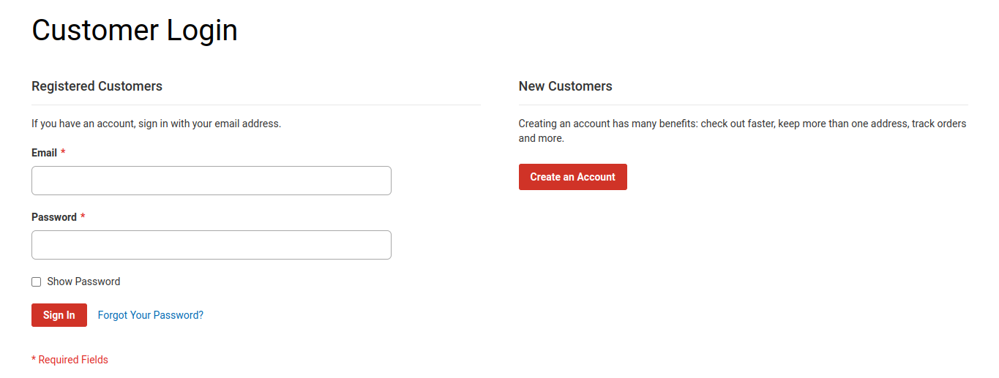
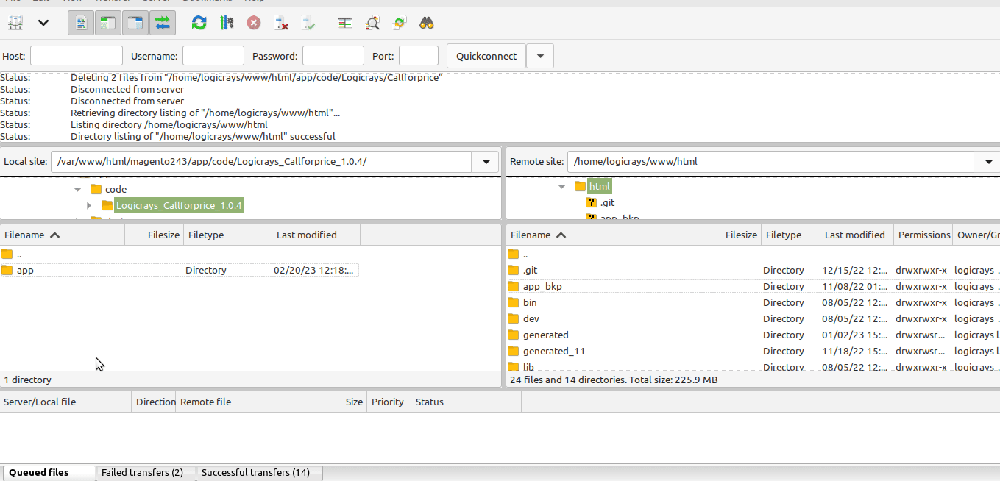

Magento Extensions Installation Document
========================================

Ready to Paste Install Magento2 Extension

.. important::

    You need to install Logicrays_Base module along with your purchased modules.

To Install Magento 2 Extension by Logicrays:
````````````````````````````````````````````

#1: Download SFTP clients
```````````````````````````
Download SFTP clients, we recommend clients: `FileZilla <https://www.logicrays.com/>`_, `WinSCP <https://www.logicrays.com/>`_. In this case, we are using **FileZilla** to install Magento 2 `Callforprice <https://www.logicrays.com/>`_.

Step 2: Download the Package
````````````````````````````
After purchasing order from Logicrays, go to `My Downloadable Products <http://store.logicrays.com/downloadable/customer/products/>`_ page to download the extension package. You have to log in User and Password before accessing the package.



Here are the screenshot of ``My Downloadable Products`` page.


Now click on extension version link to download the package.

.. image:: img/download.png
    :alt: Download the extension.

Step 3: Upload files to server
``````````````````````````````
Let’s extract the package and connect to your server using SFTP Clients above. Then upload files, folders to your server, see this video:

.. image:: img/extract.gif
    :alt: extract zip file

Upload the app folder to Magento 2 root folder.



Step 4: Run command line
````````````````````````
After uploading the module folder, you need to run the following commands in the magento 2 root directory:

Go to Magento 2 root directory and run below commands: ::

    php bin/magento setup:upgrade
    php bin/magento setup:di:compile
    php bin/magento setup:static-content:deploy


Step 5: Check result
````````````````````
Now time to check result in frontend.