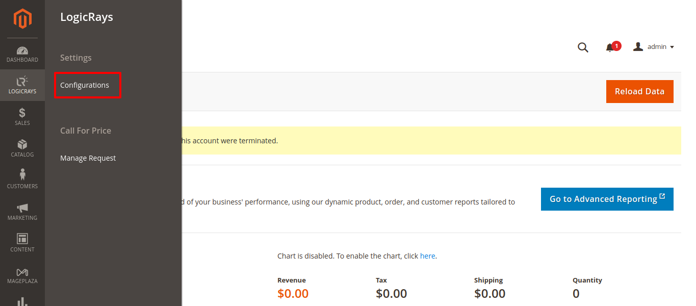
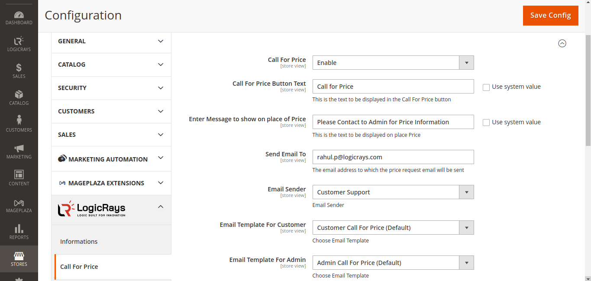
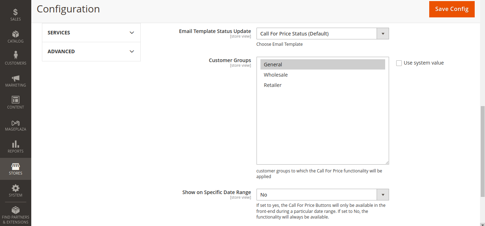

Call for Price
==============

Overview
````````

Nowadays, some stores or distributors don’t want to display the price of the product on the website; instead, they want to display the information only so that customers must contact the shop owners to ask the price or may bargain the price of the product. Logicrays has developed the Call for Price Magento 2 extension to hide the product prices and :guilabel:`Add to Cart` button and instead display :guilabel:`Call for Price` or any call to action button.

.. note::
    Hope you are able to successfully install the module.

How to configure
````````````````

Open Admin Panel, go to ``Logicrays > Settings > Configuration``



Now here you can see all the configure fields of the module. I'll explain them one by one at the end of the image.





* **Call For Price**: Choose ``Enable`` to use the functions of this module.
* **Call For Price Button Text**: When this module is apply then instead of ``Add to Cart button`` text show whatever you enter in this field. If you check the ``Use System Value`` box, the default value will be used.
* **Enter Message to show on place of Price**: Whatever text you enter in this field will appear in the frontend in place of the price.